# Entities { #entities }

## User

SyncMaster is designed with multitenancy support and role-based access (see [Roles and permissions][role-permissions]).
All nteraction requires user authentication, there is no anonymous access allowed.

Users are automatically after successful login, there is no special registration step.

## Group

All entity types (Connection, Transfer, Run, Queue) can be created only within some group.
Groups are independent from each other, and have globally unique name.

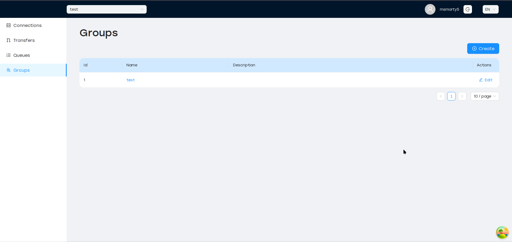

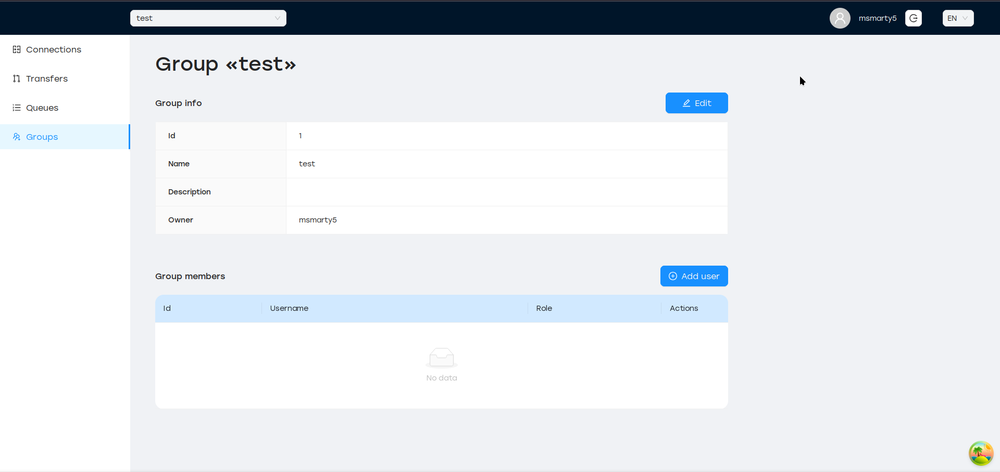

Group can be created by any user, which automatically get `OWNER` role.
This role allows adding members to the group, and assign them speficic roles:

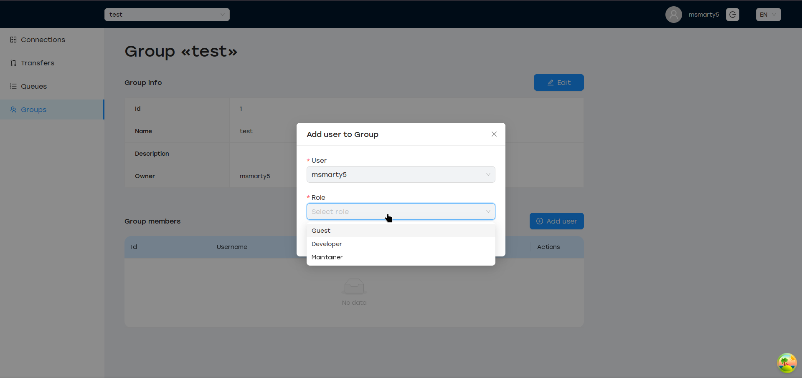

## Connection

Connection describes how SyncMaster can access specific database or filesystem. It has a type (e.g. `s3`, `hive`, `postgres`),
connection parameters (e.g. `host`, `port`, `protocol`) and auth data (`user` / `password` combination).

Connections have unique name within the group.

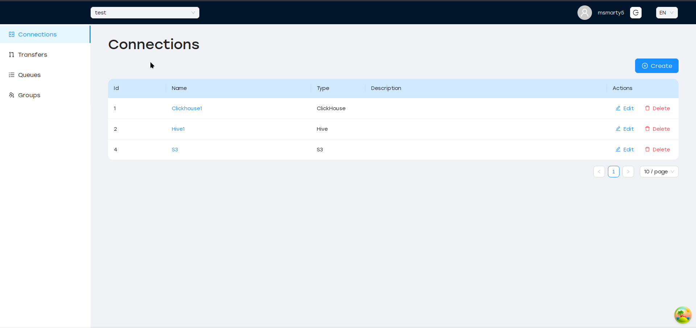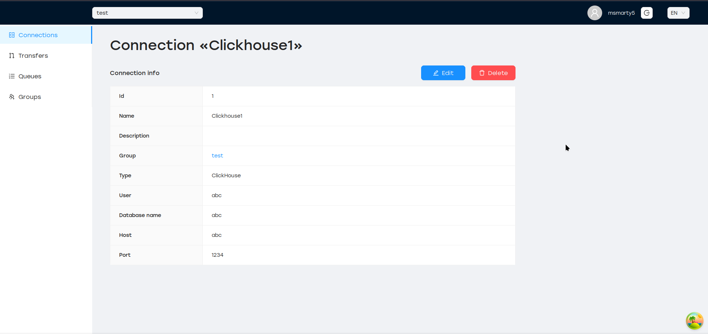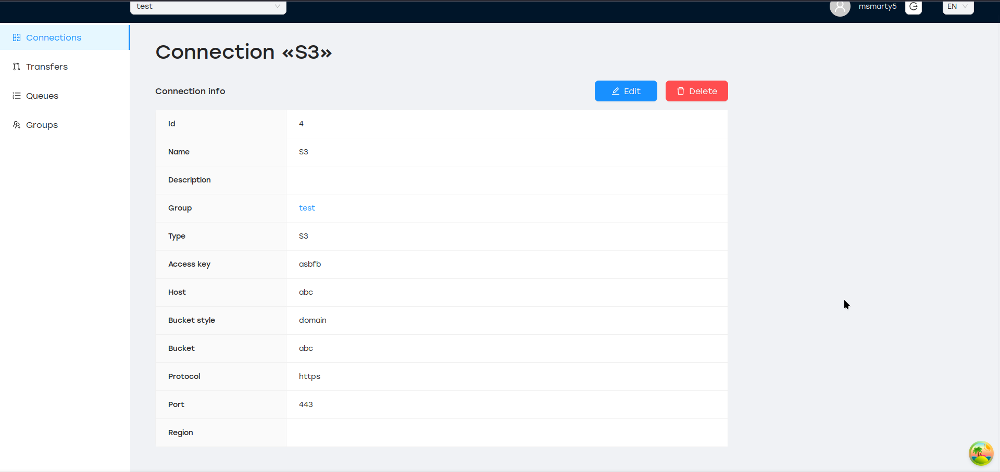

## Transfer

Transfer is the heart of SyncMaster. It describes what some data should be fetched from a source (DB connection + table name, FileSystem connection + directory path),
and what the target is (DB or FileSystem).

Transfers have unique name within a group.

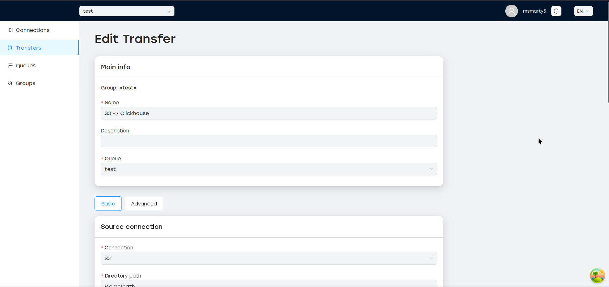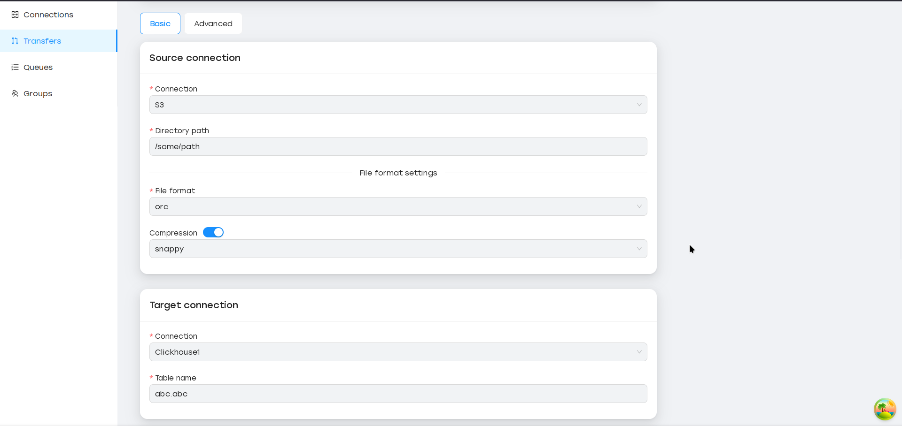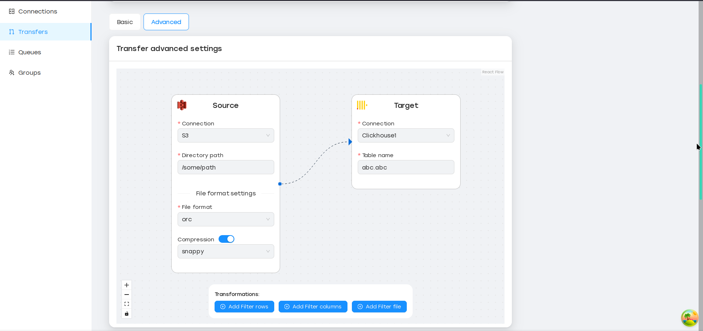

It is possible to add transformations between reading and writing steps:

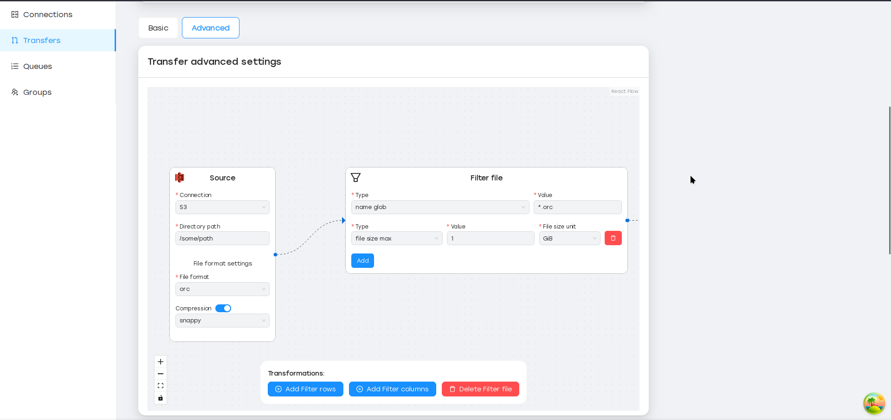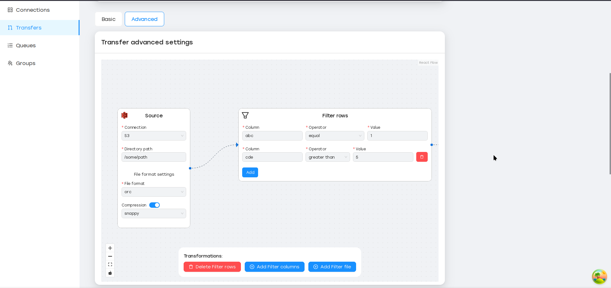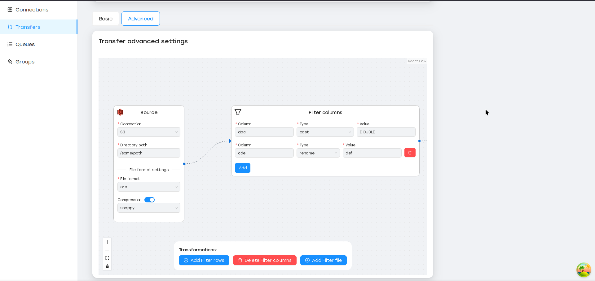

Other transfer features are:

- Choose different read strategies (`full`, `incremental`)
- Execute transfer on schedule (hourly, daily, weekly and so on)
- Set specific resources (CPU, RAM) for each transfer run

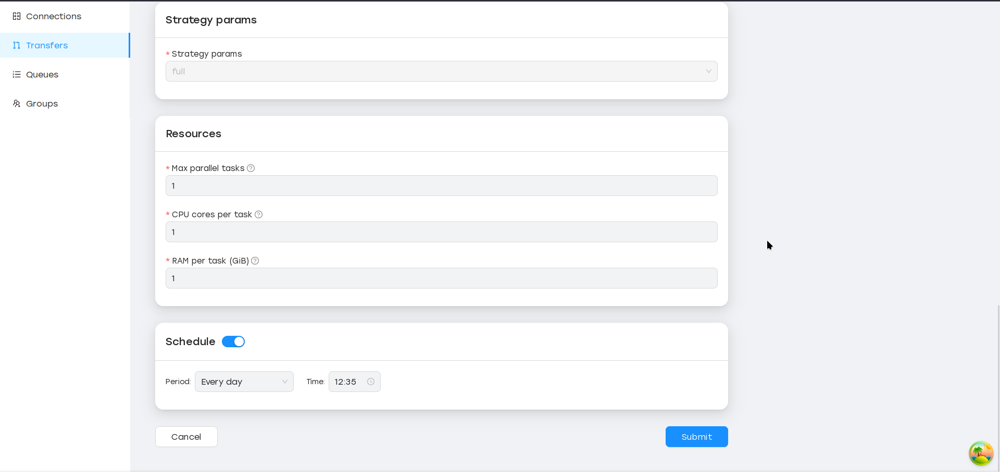

## Run

Each time transfer is started (manually or at some schedule), SyncMaster creates dedicated Run
which tracks the ETL process status, URL to worker logs and so on.

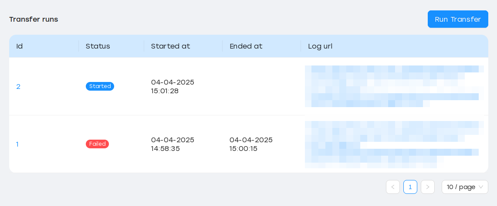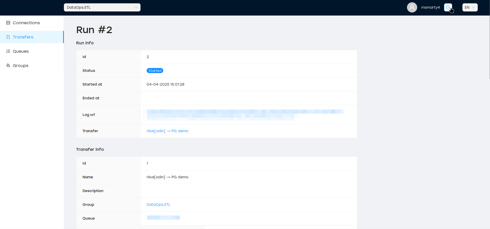

## Queue

Queue allows to bind specific transfer to a set of SyncMaster [Worker][worker]

Queue have unique name within a group, and globally unique `slug` field which is generated during queue creation.

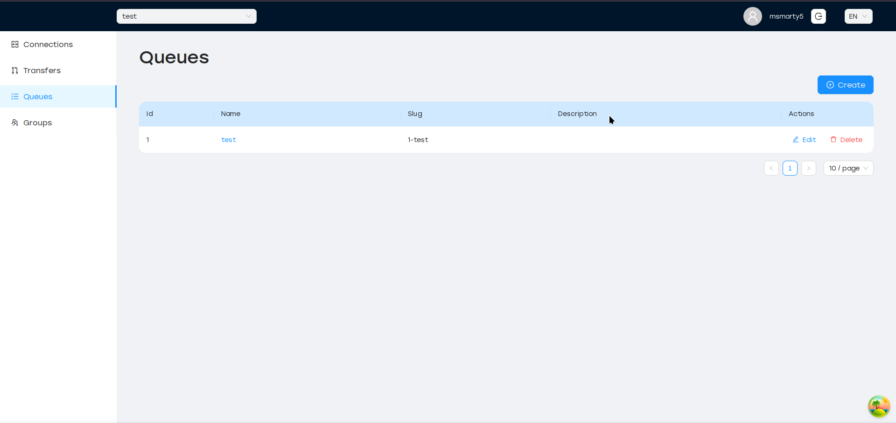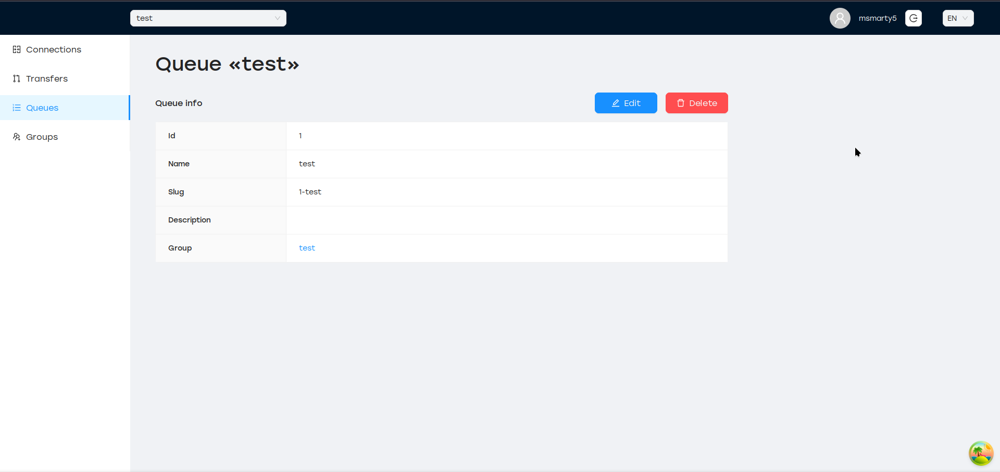

Transfers cannot be created without queue. If there are no workers bound to a queue, created runs will not be executed.

## Entity Diagram

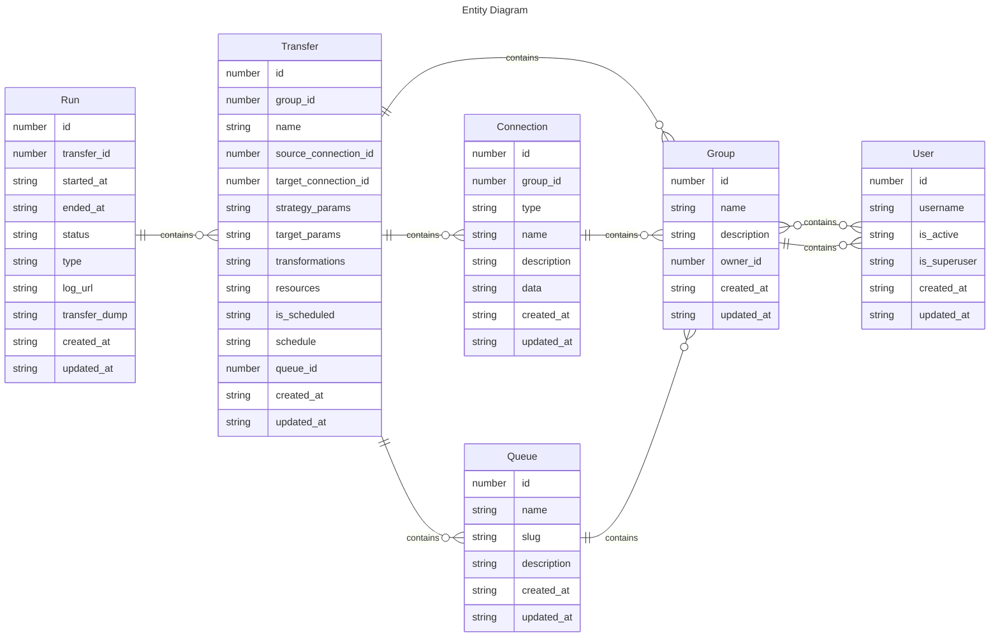
